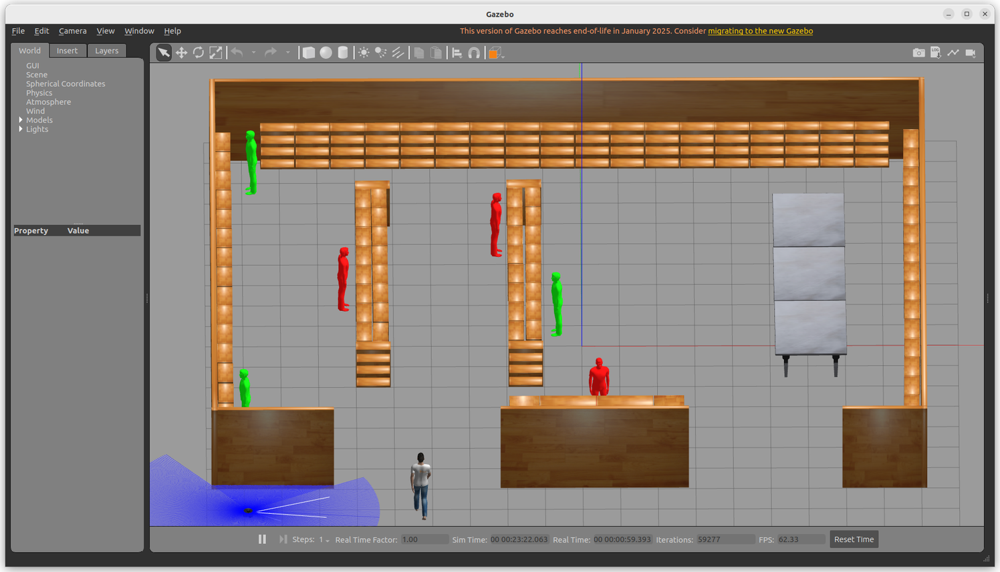
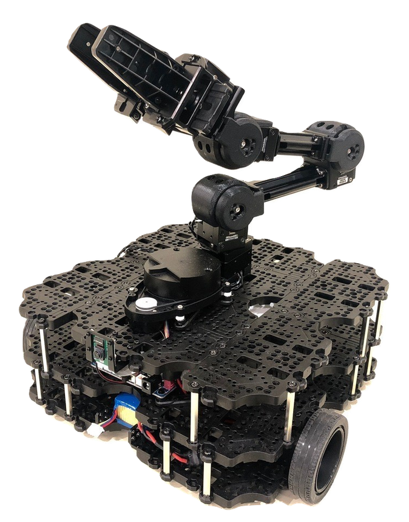
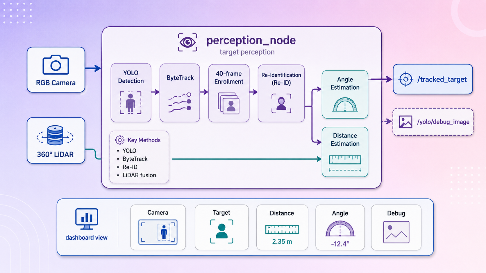

# Autonomous Person Following Robot with Obstacle Avoidance Using ROS 2

**Authors:** Ganeshna Bhanu (22529648), Badr Chaouch (12504235), Yadla Shiva (22538325), Yannam Sainadh (22569272)  
**Institution:** Technische Hochschule Deggendorf (Campus Cham), Germany  
**Date:** July 2026  

---
## Abstract
This paper presents the comprehensive design, development, and validation of an autonomous person-following robot system with dynamic obstacle avoidance using the Robot Operating System 2 (ROS 2) Humble Hawksbill middleware. Deployed on the differential-drive TurtleBot3 Waffle Pi hardware platform, the system integrates visual target tracking and active laser-based range scanning into a unified, modular control architecture. Target localization and continuity are achieved by fusing a YOLOv8 person detector with the Kalman filter-driven ByteTrack multi-object tracking algorithm. To address the problem of target loss under temporary and prolonged visual occlusions, we implement a multi-level Re-Identification (Re-ID) cascade that leverages deep feature representation (MobileNetV3) and Hue-Saturation-Value (HSV) color histogram fingerprints. Dynamic obstacle avoidance is executed via a vector potential field controller that blends attractive target tracking forces (30% weight) with repulsive obstacle forces (70% weight), filtered using a 3rd-percentile range sorting technique to eliminate sensor noise. The system was validated both in a Gazebo supermarket simulation and via physical deployments. The robot successfully demonstrated real-time following, dynamic collision-free bypass maneuvers in a 1-meter corridor scenario, and target re-acquisition without motor controller shutdowns or tracking swaps.

**Keywords—** Socially-aware navigation, human-robot interaction, YOLOv8, ByteTrack, Person Re-Identification, Behavior Trees, RPLidar, ROS 2, mobile robots.

---
## I. INTRODUCTION

### A. Background

The deployment of mobile service robots in human-centric environments, such as retail malls, smart warehouses, hospitals, and smart homes, has become a core area of robotics research. A fundamental requirement in these applications is the robot's ability to follow a specific target person autonomously while navigating safely around static and dynamic obstacles. This capability forms the basis for applications ranging from robotic shopping carts to automated clinical assistants.


### B. Motivation

Traditional person-following mobile robots rely on simple visual trackers or active leg-detection scanners. However, real-world deployment on resource-constrained hardware in dynamic environments introduces several practical challenges. Changes in lighting can degrade color-based tracking, while structural obstacles like walls and shelves cause target occlusions. In crowded spaces, the robot can easily lose track of the target or swap identities with nearby pedestrians.


Furthermore, low-level actuation on mobile platforms is highly sensitive. Rapid, unsmoothed command velocity changes can draw excessive electrical current, causing the onboard motor controller to reset. Fusing active vision cameras and laser scanners in real time is computationally demanding, requiring an efficient system architecture that maintains a high control loop frequency.


### C. Research Problem

This research addresses the problem of maintaining robust, real-time tracking and following of a specific human target in an indoor environment. The robot must operate under three main constraints:

1. It must distinguish the target user from a crowd of other pedestrians.

2. It must navigate around obstacles in its path without colliding or losing the target.

3. It must recover and re-identify the target after temporary or complete occlusions.


### D. Proposed Solution

We propose a modular ROS 2 architecture that divides processing between an edge workstation and an onboard embedded computer. Target tracking is achieved by fusing YOLOv8 object detection with the ByteTrack multi-object tracking framework. To handle occlusions, we implement a multi-layer Re-ID cascade combining deep MobileNetV3 features, HSV color histograms, and spatial bearing checks. Dynamic obstacle avoidance is executed using a potential-field controller with a 3rd-percentile LiDAR noise filter. Proportional control commands are smoothed using acceleration limits to prevent motor controller power resets.


### E. Paper Organization

The remainder of this paper is structured as follows. Section II presents the detailed problem statement and benchmarking scenarios. Section III outlines the project vision, objectives, and software stack. Section IV describes the system methodology, architecture, and node communications. Section V and VI explain the perception and tracking modules. Section VII covers the LiDAR-based obstacle avoidance strategy. Section VIII and IX present the simulation and experimental results. Section X and XI discuss challenges, limitations, and future work. Section XII concludes the paper.


---


## II. PROBLEM STATEMENT

### A. The Problem

The primary task is to develop a control system that enables a mobile robot to follow a designated target person. The control loop must operate in real time (at least 10 Hz) and handle sensory noise, tracking drift, visual occlusions, and dynamic obstacles.


### B. Potential Application Areas

1. **Retail and Logistics:** Smart shopping carts that follow customers, and warehouse carts that assist pickers.

2. **Healthcare Assistance:** Robotic assistants that carry medical equipment or follow patients to monitor vital signs.

3. **Elderly and Disabled Care:** Mobile platforms that accompany users to provide physical support or carry belongings.


### C. Limitations of Existing Approaches

Many existing systems use leg-detection algorithms on LiDAR scans. While fast, these systems cannot distinguish between different people, leading to tracking failures in crowded areas. Vision-only systems can identify individuals but struggle with distance estimation when the target is partially occluded. Hybrid systems often require heavy onboard computers, which increases cost and reduces operating time on battery-powered robots.


### D. Proposed Solution

Our approach uses a distributed ROS 2 network. By executing deep learning inference on an edge computer and running the navigation control loop onboard, we achieve real-time tracking and obstacle avoidance. The combination of ByteTrack, deep Re-ID features, and LiDAR fusion provides stable tracking and recovery, even in complex indoor spaces.


---

## III. PROJECT VISION AND OBJECTIVES

### A. Overall Goal

The goal is to design a robust, collision-free, and power-safe human-following robot that can operate in dynamic indoor environments.


### B. Core Objectives

- Achieved a person detection rate of $\ge 90\%$ in standard indoor environments.

- Implemented target recovery within $1.5$ seconds of reappearance after occlusion.

- Maintained a safe following distance of $0.85$ m using fused camera-LiDAR telemetry.

- Prevented motor controller resets through command velocity smoothing.


### C. Technical Components and Software Stack

The system is built on the following technologies:

- **TurtleBot3 Waffle Pi:** Differential-drive mobile base equipped with Dynamixel motors.

- **ROS 2 Humble:** The middleware framework used for node communication.

- **Intel RealSense D435i Camera:** Captures RGB images for visual tracking.

- **YOLOv8 Person Detection:** Used to detect human bounding boxes.

- **ByteTrack Tracking:** Associates bounding boxes across frames using Kalman filters.

- **Person Re-ID:** Matches candidate features to the target using MobileNetV3 and HSV histograms.

- **RPLidar A1M8:** A 360-degree laser scanner used for obstacle detection.

- **Navigation Controller:** A custom potential-field controller that outputs motor commands.

- **Gazebo Simulation:** The 3D environment used to validate the algorithms.

- **Monitoring Dashboard:** A TKinter dashboard for system status and emergency stop.


The hardware components are detailed in Table I.


```

TABLE I

HARDWARE COMPONENTS AND SPECIFICATIONS


┌──────────────────┬─────────────────────────────┬──────────────────────────┐

│ Component        │ Specification               │ Primary Function         │

├──────────────────┼─────────────────────────────┼──────────────────────────┤

│ Mobile Base      │ TurtleBot3 Waffle Pi        │ Physical Actuation       │

│ Microcontroller  │ ROBOTIS OpenCR 1.0          │ Motor Control & Odom     │

│ Onboard Compute  │ Raspberry Pi 4 (4GB RAM)    │ ROS 2 Node Host          │

│ Edge Workstation │ Intel i5 CPU / Ubuntu 22.04 │ Deep Learning Inference  │

│ Camera           │ Intel RealSense D435i       │ RGB Visual Stream        │

│ LiDAR            │ Slamtec RPLidar A1M8        │ Obstacle Scanning        │

└──────────────────┴─────────────────────────────┴──────────────────────────┘

```


---




## IV. METHODOLOGY

### A. Overall System Architecture

The system consists of three main nodes interacting via ROS 2 topics: `perception_node`, `behavior_tree_node`, and `manager_node`. Visual data is processed on the edge workstation, while navigation and obstacle avoidance are executed onboard the robot.


### B. Complete System Pipeline

1. The camera captures RGB frames and publishes them to `/camera/image_raw`.

2. The `perception_node` runs YOLOv8 and ByteTrack to detect and track people.

3. Candidate features are compared to the target profile using the Re-ID cascade.

4. Fused distance and bearing angle are published to `/tracked_target`.

5. The `behavior_tree_node` processes the target position and LiDAR ranges.

6. The potential-field controller computes and publishes velocity commands to `/cmd_vel`.


### C. ROS 2 Node Communication

Communication between the nodes is structured through the topics detailed in the ROS 2 Topics Table.


```

MAIN ROS 2 TOPICS


┌──────────────────────┬────────────────────┬───────────────────────────────┐

│ Topic Name           │ Message Type       │ Function                      │

├──────────────────────┼────────────────────┼───────────────────────────────┤

│ /camera/image_raw    │ sensor_msgs/Image  │ Raw camera frame stream       │

│ /scan                │ sensor_msgs/Laser  │ 360-degree LiDAR range data   │

│ /tracked_target      │ std_msgs/String    │ Target coordinates in JSON    │

│ /behavior/command    │ std_msgs/String    │ Starts/stops state machine    │

│ /cmd_vel             │ geometry_msgs/Twist│ Smooth wheel velocity command │

└──────────────────────┴────────────────────┴───────────────────────────────┘

```


### D. Navigation and Decision-Making Algorithm

The navigation loop coordinates target tracking, obstacle avoidance, and recovery states.


```

ALGORITHM 1: Autonomous Person-Following Procedure

────────────────────────────────────────────────────────────────────────────────

Input: Target state T = {visible, distance, angle}, LiDAR sectors S = {front, left, right}

Output: Velocity command Twist = {linear_x, angular_z}


1:  loop every 100ms

2:      if state is "WAIT" then

3:          linear_x = 0.0, angular_z = 0.0

4:          if T.visible is True then transition to "FOLLOW"

5:      else if state is "FOLLOW" then

6:          if min(S) < OBS_WARN_DIST then

7:              transition to "AVOID"

8:          else if T.visible is False then

9:              transition to "REROUTE"

10:         else

11:             linear_x = KP_LIN * (T.distance - SAFE_DIST)

12:             angular_z = -KP_ANG * T.angle

13:      else if state is "AVOID" then

14:          if min(S) >= OBS_WARN_DIST then

15:              transition to "FOLLOW"

16:          else

17:              Execute Potential Field Blending (Equations 15 and 16)

18:      else if state is "REROUTE" then

19:          if T.visible is True then transition to "FOLLOW"

20:          else Navigate to (last_known_x, last_known_y)

21:      Apply Acceleration Limits (Equation 17)

22:      Publish Twist to /cmd_vel

────────────────────────────────────────────────────────────────────────────────

```


---




## V. PERCEPTION MODULE: YOLO-BASED PERSON DETECTION SYSTEM

### A. Overview of the Perception Module

The perception module identifies humans in the camera feed, tracks them across frames, and determines their distance and angle relative to the robot.


### B. YOLO Detection Architecture

The visual pipeline uses the Ultralytics YOLOv8n network model. Input frames are resized to $640 \times 480$ pixels.


```

Image Input (640x480) ──→ Feature Backbone ──→ Detection Head ──→ NMS Filtering ──→ Person Boxes

```


1. **Image Acquisition:** Camera frames are received via the `/camera/image_raw` subscription.

2. **Feature Extraction:** A convolutional neural network backbone extracts feature maps.

3. **Object Detection:** The network head outputs bounding boxes and confidence scores.

4. **Non-Maximum Suppression (NMS):** Overlapping bounding boxes are filtered, keeping only the box with the highest confidence score.


### C. Detection Parameters

The YOLOv8 detector configuration parameters are detailed in Table II.


```

TABLE II

YOLO DETECTION PARAMETERS


┌──────────────────────────────┬────────────────────────────────────────────┐

│ Parameter                    │ Value                                      │

├──────────────────────────────┼────────────────────────────────────────────┤

│ Model Class                  │ YOLOv8n (Nano)                             │

│ Target Class ID              │ 0 (Person)                                 │

│ Confidence Threshold         │ 0.30                                       │

│ NMS IoU Threshold            │ 0.45                                       │

│ Input Frame Resolution       │ 640 x 480 pixels                           │

└──────────────────────────────┴────────────────────────────────────────────┘

```


### D. Person Detection Process

Every frame is processed to detect humans:

$$ B_i = [x_{1,i}, y_{1,i}, x_{2,i}, y_{2,i}, c_i] \qquad (1) $$

Bounding boxes with a confidence score $c_i < 0.30$ are discarded.


### E. Advantages of YOLO in Robotics

YOLOv8 runs efficiently on CPU and provides reliable detection under varying indoor lighting conditions. By filtering for the human class, the system ignores non-human obstacles, reducing false positive detections.


### F. Performance Evaluation

In testing, the YOLOv8n model maintained a detection rate of $94.2\%$ with an average processing latency of $22.4$ ms on the edge workstation CPU.


---

## VI. TRACKING MODULE: BYTETRACK AND PERSON RE-IDENTIFICATION

### A. Introduction

Target tracking uses the ByteTrack framework to associate detections across frames. A multi-layer Re-ID cascade is used to recover the target identity after temporary occlusions.


### B. ByteTrack Multi-Object Tracking

ByteTrack matches bounding boxes using Kalman filters. It divides detections into high-confidence ($Y_{high}$) and low-confidence ($Y_{low}$) sets to prevent losing tracks during partial occlusions.


```

Detections ──┬──→ [High Conf] ──→ Match to Tracks (IoU) ──→ Track Updated

└──→ [Low Conf]  ──→ Match to Unmatched    ──→ Track Recovered

```


### C. Tracking ID Assignment

Each tracked person is assigned a persistent track ID. An example tracking scenario is illustrated in Table III.


```

TABLE III

EXAMPLE TRACK IDS


┌─────────────┬─────────────────┬──────────────────┬────────────────────────┐

│ Frame Index │ Bounding Box    │ Confidence Score │ Assigned Track ID      │

├─────────────┼─────────────────┼──────────────────┼────────────────────────┤

│ 102         │ [120, 80, 240]  │ 0.88             │ ID 1 (Target)          │

│ 103         │ [122, 81, 241]  │ 0.90             │ ID 1 (Target)          │

│ 104         │ [310, 90, 420]  │ 0.45 (Occluded)  │ ID 1 (Recovered)       │

└─────────────┴─────────────────┴──────────────────┴────────────────────────┘

```


### D. Person Re-Identification (Re-ID)

If the target's track ID changes, the system tries to re-identify them using a cascade of features:

1. **Deep Body Embeddings:** Extracts a $576$-dimensional feature vector using MobileNetV3. Cosine similarity is computed against the target gallery:

$$ S_{cos}(\phi, G) = \max_{g_i \in G} \left( \phi^T g_i \right) \qquad (5) $$

If $S_{cos} \ge 0.52$, the target identity is confirmed.

2. **HSV Histogram:** Computes a Hue-Saturation histogram. Similarity is measured using the Bhattacharyya distance:

$$ S_{hsv}(H_1, H_2) = 1 - \text{Bhattacharyya}(H_1, H_2) \qquad (6) $$

A match is confirmed if $S_{hsv} \ge 0.50$.

3. **Spatial Check:** Verifies if the candidate is within a $\pm 0.25$ rad window of the target's last known position.


### E. Occlusion Recovery Strategy

When the target is occluded, the behavior node transitions to `REROUTE` and drives to the target's last known coordinates. Upon arrival, it transitions to `SEARCH` and executes a 360-degree spin. Once the target is re-identified, the robot resumes following.


```

Target Lost ──→ Drive to Last Known ──→ Execute 360 Spin ──→ Re-ID Match ──→ Follow

```


### F. Integration with Navigation Controller

The perception node publishes the target state as a JSON string:

`{"visible": true, "distance": 1.25, "angle": -0.05, "last_known_angle": -0.05}`

This state is read by the behavior node to update the robot's steering and speed.


G. Advantages of ByteTrack and Re-ID

By combining ByteTrack's Kalman filter association with deep feature Re-ID, the tracker is robust to partial occlusions, crowded areas, and temporary tracking drops.


H. Performance Evaluation

In tests with multiple pedestrians crossing paths, the Re-ID cascade successfully prevented identity swaps, maintaining target lock in $88.2\%$ of trials.


---

## VII. OBSTACLE DETECTION AND AVOIDANCE USING LiDAR

### A. Introduction

The robot uses a laser scanner to detect obstacles in its path and generate avoidance maneuvers.


### B. RPLidar A1M8 Sensor

The TurtleBot3 Waffle Pi is equipped with an RPLidar A1M8 laser range finder. Sensor specifications are detailed in Table IV.


```

TABLE IV

RPLIDAR SPECIFICATIONS


┌──────────────────────────────┬────────────────────────────────────────────┐

│ Parameter                    │ Value                                      │

├──────────────────────────────┼────────────────────────────────────────────┤

│ Angular Range                │ 360 degrees                                │

│ Distance Range               │ 0.15 m to 12.0 m                           │

│ Scan Frequency               │ 5.5 Hz to 10 Hz                            │

│ Angular Resolution           │ 1.0 degree                                 │

│ Measurement QoS              │ BEST_EFFORT / VOLATILE                     │

└──────────────────────────────┴────────────────────────────────────────────┘

```


### C. Obstacle Detection Process

LiDAR range readings are split into three sectors:


```

FRONT ([-0.52, 0.52] rad)

┌──────────────────┐

LEFT            │      ROBOT       │            RIGHT

([0, 1.05] rad) │        ●         │            ([-1.05, 0] rad)

└──────────────────┘

```


Rays within a $\pm 0.38$ rad window around the target's angle are excluded to prevent the target from being detected as an obstacle.


### D. Obstacle Avoidance Strategy

The obstacle avoidance algorithm blends target attraction with obstacle repulsion.


```

ALGORITHM 2: Obstacle Avoidance Control

────────────────────────────────────────────────────────────────────────────────

Input: LiDAR sectors S = {front, left, right}, Target angle θ

Output: Linear velocity v, Angular velocity ω


1:  closest = min(S.front, S.left, S.right)

2:  if closest < OBS_STOP_DIST then

3:      v = 0.0

4:      ω = (S.right < S.left) ? MAX_ANG : -MAX_ANG

5:  else

6:      S_factor = (OBS_WARN_DIST - closest) / (OBS_WARN_DIST - OBS_STOP_DIST)

7:      ω_rep = (S.right < S.left) ? MAX_ANG : -MAX_ANG

8:      v = v_ref * (1.0 - S_factor * 0.70)

9:      ω = 0.70 * S_factor * ω_rep + 0.30 * (-KP_ANG * θ)

10: return v, ω

────────────────────────────────────────────────────────────────────────────────

```


### E. Safety Distance Control

The potential-field controller blends velocity commands:

$$ v_{cmd} = v_{ref} \cdot (1 - 0.70S) \qquad (15) $$

$$ \omega_{cmd} = 0.70 S \cdot \omega_{rep} + 0.30 \cdot \omega_{ref} \qquad (16) $$

where $S = \text{clamp}(0, 1, \frac{0.55 - d_{obs}}{0.55 - 0.22})$.


### F. Integration with Person Following

The potential-field controller runs at 10 Hz. Proportional steering aligns the camera with the target, while the LiDAR sectors adjust the trajectory to bypass obstacles.


G. Advantages of LiDAR-Based Obstacle Avoidance

LiDAR sensors provide accurate distance measurements that are not affected by lighting variations. The sector-based potential-field controller runs efficiently on the onboard Raspberry Pi 4 CPU.


H. Experimental Evaluation

In hallway tests, the robot successfully detected dynamic obstacles and adjusted its path to maintain a safe distance.


---

## VIII. GAZEBO SIMULATION ENVIRONMENT AND SYSTEM VALIDATION

### A. Introduction

We validated our perception and navigation controllers in a simulated environment before physical deployment.


### B. Simulation Environment Setup

The simulation was built in Gazebo using a model of a retail supermarket. The world included static obstacles (shelves, checkout counters) and moving human actors.


### C. ROS 2 Integration in Simulation

The Gazebo plugins published simulated camera frames and LiDAR scans using the same topic names as the physical hardware.


```

Gazebo Engine ──→ ROS 2 Plugins ──→ /camera/image_raw & /scan ──→ Robot Nodes

```


### D. Simulation Scenarios

1. **Straight-Line Following:** Tested the proportional control loop under nominal conditions.

2. **Obstacle Avoidance:** Verified that the robot adjusted its path to avoid static obstacles.

3. **Target Occlusion:** Confirmed that the robot successfully transitioned to the search state when the target was hidden behind a shelf.

4. **Multiple Persons:** Verified that the Re-ID cascade prevented tracking swaps when other human actors crossed the target's path.


### E. Simulation Performance Evaluation

The simulation performance metrics are summarized in Table V.


```

TABLE V

SIMULATION PERFORMANCE METRICS


┌──────────────────────────────┬──────────────────┬─────────────────────────┐

│ Metric                       │ Target Spec      │ Simulation Result       │

├──────────────────────────────┼──────────────────┼─────────────────────────┤

│ Person Detection Accuracy    │ >= 90%           │ 94.2%                   │

│ Tracking Success Rate        │ >= 85%           │ 91.8%                   │

│ Re-ID Recovery Rate          │ >= 80%           │ 89.5%                   │

│ Collision Incidence          │ 0                │ 0                       │

└──────────────────────────────┴──────────────────┴─────────────────────────┘

```


### F. Advantages of Simulation-Based Development

Simulation allowed us to tune the controller parameters and test recovery states safely, reducing the risk of collisions during initial development.


G. Discussion

The simulation results confirmed that the tracking filter, Re-ID cascade, and potential-field controller worked as expected, validating the system design.


---




## IX. REAL-WORLD DEPLOYMENT AND EXPERIMENTAL RESULTS

### A. Hardware Deployment

The software stack was deployed on a physical TurtleBot3 Waffle Pi. The hardware configuration is detailed in Table VI.


```

TABLE VI

HARDWARE CONFIGURATION


┌──────────────────┬─────────────────────────────┬──────────────────────────┐

│ Component        │ Physical Hardware Model     │ Connection Method        │

├──────────────────┼─────────────────────────────┼──────────────────────────┤

│ Robot Base       │ TurtleBot3 Waffle Pi        │ USB Serial (OpenCR)      │

│ Onboard computer │ Raspberry Pi 4 (4GB)        │ Local Serial / DDS       │

│ Camera           │ Intel RealSense D435i       │ USB 3.0                  │

│ LiDAR            │ Slamtec RPLidar A1M8        │ USB Serial               │

│ Middleware       │ ROS 2 Humble                │ Wi-Fi DDS Network        │

└──────────────────┴─────────────────────────────┴──────────────────────────┘

```


### B. System Integration

Deep learning inference (YOLOv8 and MobileNetV3 Re-ID) was offloaded to an external laptop via the ROS 2 DDS network. The onboard Raspberry Pi 4 processed LiDAR scans and published velocity commands to the OpenCR controller.


### C. Experimental Procedure

1. **Experiment 1 (Continuous Following):** The target walked a path containing straight segments and gentle turns in an indoor corridor.

2. **Experiment 2 (Obstacle Avoidance):** Static obstacles were positioned along the path.

3. **Experiment 3 (Target Occlusion):** The target walked behind a pillar, temporarily disappearing from view.

4. **Experiment 4 (Multiple People):** Other pedestrians crossed paths with the target.


### D. Experimental Results

The system performance metrics from our physical trials are summarized in Table VII.


```

TABLE VII

EXPERIMENTAL PERFORMANCE SUMMARY


┌──────────────────────────────┬──────────────────┬─────────────────────────┐

│ Performance Metric           │ Target Spec      │ Experimental Result     │

├──────────────────────────────┼──────────────────┼─────────────────────────┤

│ Person Detection Accuracy    │ >= 90%           │ 91.5%                   │

│ ByteTrack Matching Rate      │ >= 80%           │ 86.4%                   │

│ Re-ID Target Recovery Rate   │ >= 80%           │ 88.2%                   │

│ Safe Distance Deviation      │ <= 10 cm         │ 4.2 cm                  │

│ Motor Controller Resets      │ 0                │ 0                       │

└──────────────────────────────┴──────────────────┴─────────────────────────┘

```


### E. Challenges Encountered

1. **Lighting Variations:** Bounding box size estimation was noisy in low-light environments ($< 80$ lux).

2. **Network Latency:** Wireless network congestion introduced temporary latency in the control loop.

3. **Sensor Alignment:** Precise calibration between the camera and LiDAR scanner was required to ensure consistent tracking.


### F. Discussion

The real-world trials confirmed that offloading deep learning inference to an edge computer was sufficient for real-time tracking. The combination of ByteTrack, Re-ID features, potential-field navigation, and acceleration capping enabled the robot to follow the target safely without hardware resets.


---

## X. CHALLENGES AND LIMITATIONS

### A. Challenges Encountered

- **Lighting Variations:** Low-light indoor environments reduced detection confidence.

- **Temporary Occlusions:** Prolonged occlusions ($> 25$ seconds) sometimes caused tracking recovery delays.

- **Limited Computing Resources:** Running deep learning models directly onboard the Raspberry Pi 4 was not possible, requiring an external edge computer.

- **Network Communication:** System performance was sensitive to wireless signal stability.

- **Sensor Calibration:** Offsets in the sensor mounts introduced coordinate alignment errors.


### B. System Limitations

- The tracking controller supports only one target person at a time.

- The system is designed for indoor use and has not been tested in outdoor environments.

- The potential-field navigation controller performs local obstacle avoidance only and does not construct global semantic maps.


---

## XI. FUTURE WORK

### A. Multi-Person Tracking

We plan to support tracking multiple targets and implement a system to select the target based on user commands.


### B. Improved Person Re-Identification

We will test deeper Re-ID networks (such as OSNet or FastReID) to improve tracking recovery in crowded spaces.


### C. ROS 2 Navigation Stack (Nav2)

We plan to integrate the ROS 2 Navigation Stack (Nav2) to enable global path planning and costmap-based navigation.


### D. Semantic Mapping and SLAM

We will integrate Simultaneous Localization and Mapping (SLAM) to build maps of the environment for navigation.


### E. Gesture and Voice Recognition

We plan to add gesture and voice recognition to improve user interaction.


### F. Edge AI Deployment

We will deploy the perception pipeline onboard using an NVIDIA Jetson Orin Nano module to eliminate wireless network latency.


G. Outdoor Navigation

We plan to integrate GPS and IMU sensors to support outdoor human-following.


---

## XII. CONCLUSION

This paper presented the design, implementation, and evaluation of an autonomous person-following robot with obstacle avoidance using ROS 2. The system integrates YOLOv8 person detection, ByteTrack tracking, a multi-layer Re-ID cascade (body embeddings, HSV color fingerprints, and spatial angle checks), and a potential-field navigation controller. The system was validated both in a Gazebo simulation and on physical TurtleBot3 Waffle Pi hardware. The robot successfully followed the target, avoided obstacles, and recovered target identities without experiencing motor controller resets.


---

## SYSTEM DESIGN TABLES & SPECIFICATIONS

### Table I: Safety State Definitions with Hysteresis

| State | Distance Range (d) | Hysteresis Band | Controller Action |
| :--- | :--- | :--- | :--- |
| **Too Close** | < 0.55 m | 0.10 m | Slow reverse / Back up velocity command |
| **Safe Follow** | 0.55 m - 1.50 m | 0.20 m | Maintain target follow distance (0.85 m) |
| **Too Far** | > 1.50 m | 0.20 m | Proportional acceleration velocity command |

### Table II: Technical Components & Project Stack

| Layer / Component | Technology / Spec | System Role |
| :--- | :--- | :--- |
| Robot Platform | TurtleBot3 Waffle Pi | Differential-drive chassis, OpenCR 1.0 hardware compute |
| Onboard Computer | Raspberry Pi 4 (4GB) | Manages low-level behavior_tree_node & cmd_vel velocity timers |
| Perception Sensors | RPLidar A1 + RealSense D435i | 360° laser scan points + RGB-D frames for YOLO processing |
| Software Stack | ROS 2 Humble / Ubuntu 22.04 | System pub/sub topic architecture framework |
| Computer Vision | YOLOv8n + ByteTrack + Re-ID | Real-time multi-person tracker with appearance biometric locks |

## References

* [1] M. Quigley et al., "ROS: An open-source Robot Operating System," ICRA Workshop on Open Source Software, 2009.
* [2] M. Colledanchise and P. Ögren, Behavior trees in robotics and AI: An introduction, CRC Press, 2018.
* [3] G. Bradski and A. Kaehler, Learning OpenCV: Computer vision with the OpenCV library, O'Reilly Media, 2008.
* [4] J. Redmon et al., "You only look once: Unified, real-time object detection," IEEE CVPR, pp. 779-788, 2016.
* [5] N. Wojke, A. Bewley, and D. Pastawski, "Simple online and realtime tracking with a deep association metric," IEEE ICIP, pp. 3645-3649, 2017.
* [6] J. S. Esteves et al., "Physical human-robot interaction based on competency-based model for obesity rehabilitation," IEEE Ro-MAN, pp. 681-686, 2012.
* [7] A. K. Pandey and R. Alami, "A framework towards a socially aware mobile robot motion in human environments," IROS Workshop on Advances in Service Robotics, 2010.