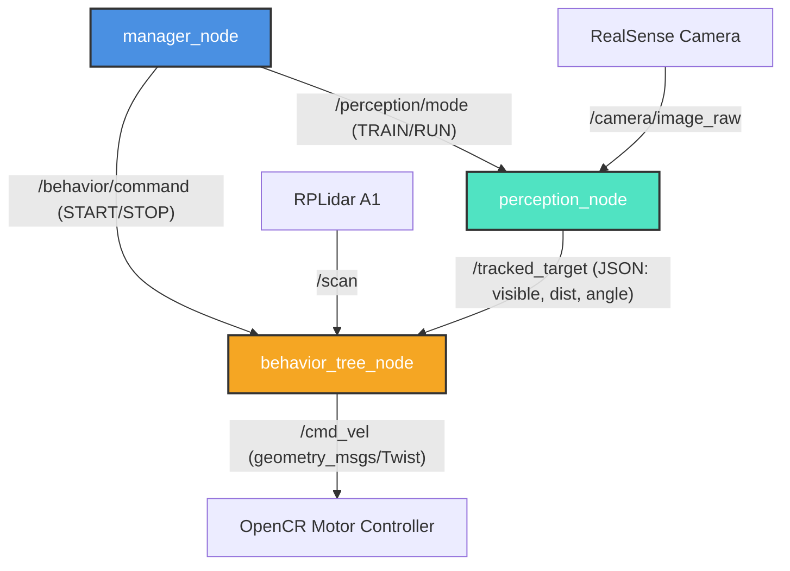

# Autonomous Person-Following Robot with Obstacle Avoidance Using ROS 2

This repository contains the complete design, implementation, and evaluation of an autonomous person-following robot with dynamic obstacle avoidance developed under the **ROS 2 Humble Hawksbill** middleware framework. 

The system leverages a decoupled, distributed CPU-only architecture that splits heavy perception models (YOLOv8 + ByteTrack + Person Re-ID) from local reactive planning (Vector Potential Field + LiDAR sectors + velocity slew-rate limiting) to ensure robust, real-time tracking (10 Hz) on resource-constrained hardware such as the **TurtleBot3 Waffle Pi**.

---

## 📸 Project Gallery & Visual Demonstrations

### 1. Real World Deployment & Hardware Setup
Below is the real-world physical deployment setup of the autonomous robot cart in a supermarket environment and the physical TurtleBot3 Waffle hardware stack equipped with an Intel RealSense RGB-D camera and 360° RPLidar.

| Real-World Supermarket Deployment | Physical Hardware Platform (TurtleBot3 Waffle) |
| :---: | :---: |
|  |  |

---

### 2. Overall Model Architecture
System architecture overview detailing inter-node communications (`manager_node`, `perception_node`, `behavior_tree_node`, and `supermarket_dashboard`).


---

### 3. Perception Node Architecture
Detailed computer vision processing pipeline showing frame acquisition, YOLOv8 target detection, ByteTrack temporal association, 40-frame enrollment, OSNet Re-Identification (Re-ID), and LiDAR depth/bearing estimation.


---

### 4. Behavior Tree Node Architecture
State machine navigation controller showing the finite state machine (`WAIT`, `FOLLOW`, `AVOID`, `REROUTE`, `SEARCH`, `ACQUIRE`), velocity slew-rate limiting, vector potential field calculations, and motor command execution.


---

### 5. Simulation Environments & World Models
Custom Gazebo simulation world (`turtlebot3_house.world`) featuring dynamic human targets, aisle shelves, moving obstacle pedestrians, and 360° LiDAR range field-of-view overlays.

| Supermarket World (Top-Down Aisle View) | Real World Demo | Waffle FOV |
| :---: | :---: | :---: |
|  |  |  |

---

### 6. Telemetry & Diagnostic Dashboard
Real-time diagnostic control dashboard (`supermarket_dashboard.py`) rendering live YOLO visual feeds, target tracking telemetry vectors, 180° front LiDAR radar maps, system state logs, and emergency override controls.


---

## 1. System Architecture

The project consists of three core ROS 2 nodes coordinated via state machines and topic subscriptions:



1. **`manager_node`**: Orchestrates the system setup sequence. It puts the perception engine into `TRAIN` mode, holds the robot base in a `WAIT` state for 5 seconds until calibration is complete, and publishes `START` to active navigation controllers once a biometric identity lock is established.
2. **`perception_node`**: Intercepts camera frames to detect humans using **YOLOv8**, associates bounding boxes over time using **ByteTrack**, and enforces target locking via a **4-level Re-ID cascade** (ByteTrack temporal continuity $\rightarrow$ OSNet body appearance similarity $\ge 0.70$ $\rightarrow$ Torso HSV histogram Bhattacharyya similarity $\ge 0.50$ $\rightarrow$ spatial angle fallback $\pm 0.25\text{ rad}$).
3. **`behavior_tree_node`**: Processes target vectors and 360-degree LiDAR scan ranges at 10 Hz. Applies a **3rd-percentile range filter** to eliminate sensor noise, excludes the target's legs using a **distance-gated bearing cone**, and outputs velocity commands smoothed by an **acceleration slew-rate limiter** (capped at $\Delta v = 0.035\text{ m/s}$ and $\Delta \omega = 0.12\text{ rad/s}$ per tick) to prevent battery brownouts.

---

## 2. Project Directory Structure

```
.
├── README.md                               # Root setup guide
└── CASE STUDY
    └── CASE STUDY MAIN
        ├── CODE                            # ROS 2 Package Source Code
        │   ├── launch                      # ROS 2 launch scripts
        │   │   ├── turtlebot3_house.launch.py       # Gazebo launch wrapper
        │   │   └── supermarket_navigation.launch.py  # Navigation nodes launcher
        │   ├── robot_follower              # Main Python nodes package
        │   │   ├── __init__.py
        │   │   ├── perception_node.py      # Vision perception node (YOLO + Re-ID)
        │   │   ├── behavior_tree_node.py   # State machine & Potential Field avoidance
        │   │   └── manager_node.py         # Lifecycle manager node
        │   ├── params                      # YAML parameter configuration files
        │   │   └── robot_follower_params.yaml
        │   ├── worlds                      # Gazebo simulation environments (.world)
        │   │   └── turtlebot3_house.world
        │   ├── models                      # 3D models and meshes for shelves
        │   │   └── mart_walls      
        │   ├── maps                        # Slam occupancy grid maps (.pgm, .yaml)
        │   │   ├── my_new_map4.yaml
        │   │   └── my_new_map4.pgm
        │   ├── package.xml                 # ROS 2 package dependencies manifest
        │   ├── setup.py                    # Ament python setup script
        │   └── supermarket_dashboard.py    # Tkinter telemetry diagnostic GUI
        ├── REPORT                          # Academic IEEE Paper Output
        │   ├── ieee_report.pdf             # Pre-rendered PDF report
        │   ├── ieee_report.docx            # Editable Word report
        │   └── ieee_report.md              # Markdown raw report
        ├── IMAGES                          # Technical flowcharts, diagrams, and figures
        └── WORK                            # Validation demo video guides
            ├── OBSAV M.mp4                 # Obstacle avoidance demo video
            ├── RR MV.mp4                 # Rerouting and occlusion recovery video
            ├── RRLC M.mp4                 # Target re-acquisition video
            └── SIM + DASH.mp4              # Dashboard simulation interface video
```

---

## 3. System Requirements & Dependencies

### ROS 2 & System Packages
The package must be built on **Ubuntu 22.04 LTS** running **ROS 2 Humble** (Desktop or Base).
Install required packages using `apt`:
```bash
sudo apt update
sudo apt install -y \
  ros-humble-navigation2 \
  ros-humble-nav2-bringup \
  ros-humble-slam-toolbox \
  ros-humble-turtlebot3 \
  ros-humble-turtlebot3-gazebo \
  ros-humble-turtlebot3-simulations
```

### Python Dependencies
The perception, Re-ID, and telemetry modules run inside a Python 3.10 virtual environment or local workspace.
Install the required packages:
```bash
pip install \
  numpy==1.24.3 \
  opencv-python>=4.8.0 \
  PyYAML>=6.0 \
  scipy>=1.11.0 \
  ultralytics>=8.0.0 \
  torch>=2.0.0 \
  torchvision>=0.15.0 \
  torchreid==0.2.5 \
  gdown \
  tensorboard
```

---

## 4. Setup & Compilation Guide

Follow these steps to compile the ROS 2 package:

1. Create a clean ROS 2 workspace directory:
   ```bash
   mkdir -p ~/robot_follower_ws/src
   ```
2. Copy the contents of the `CODE/` folder into your new workspace source folder:
   ```bash
   cp -r "CASE STUDY/CASE STUDY MAIN/CODE" ~/robot_follower_ws/src/robot_follower
   ```
3. Navigate to the workspace and build:
   ```bash
   cd ~/robot_follower_ws
   colcon build --symlink-install
   ```
4. Source the built installation space:
   ```bash
   source install/setup.bash
   ```

---

## 5. Running the Simulation

Execute the following commands in separate terminals to launch the system:

### Terminal 1: Launch the Gazebo World
Launches the Waffle Pi robot inside the TurtleBot3 House simulation.
```bash
export TURTLEBOT3_MODEL=waffle
source /opt/ros/humble/setup.bash
ros2 launch robot_follower turtlebot3_house.launch.py
```

### Terminal 2: Run the Vision Perception Node
Loads YOLOv8 and OSNet to start detecting and tracking humans.
```bash
cd ~/robot_follower_ws
source install/setup.bash
# Run on CPU if GPU is not available
export CUDA_VISIBLE_DEVICES=""
ros2 run robot_follower perception_node
```

### Terminal 3: Run the Behavior Tree Node
Starts the Potential Field steering controller and LiDAR scan processor.
```bash
cd ~/robot_follower_ws
source install/setup.bash
ros2 run robot_follower behavior_tree_node
```

### Terminal 4: Run the Lifecycle Manager Node
Handles system startup and commands the training phase.
```bash
cd ~/robot_follower_ws
source install/setup.bash
ros2 run robot_follower manager_node
```
*(The robot will hold in a training state for 5 seconds to lock onto the target in front, then switch to following.)*

### Terminal 5: Start the Telemetry Dashboard
Launches the diagnostic telemetry dashboard.
```bash
cd ~/robot_follower_ws/src/robot_follower
python3 supermarket_dashboard.py
```

---

## 6. Setup-Specific Code Modifications

To run this repository on your custom hardware setup, you must adjust specific file paths, parameters, and network topics in the source code:

### A. Camera Topic Mapping (Simulation vs Physical Hardware)
By default, the simulation publishes raw camera frames on a different topic than the physical Intel RealSense camera.
* **File to modify:** `launch/` files or the perception node launch parameters.
* **Topic Parameter in [perception_node.py](file:///home/ganeshna/robot_follower_ws/src/robot_follower/robot_follower/perception_node.py) (Line 206):**
  * For **Simulation (Gazebo):**
    ```python
    self.declare_parameter("camera_topic", "/camera/image_raw")
    ```
  * For **Physical RealSense Camera:**
    ```python
    self.declare_parameter("camera_topic", "/camera/camera/color/image_raw")
    ```

### B. Hardware Actuation Limits & Tuning (OpenCR Protection)
To prevent battery voltage drops on your physical mobile base, you can adjust the acceleration constraints.
* **File to modify:** [behavior_tree_node.py](file:///home/ganeshna/robot_follower_ws/src/robot_follower/robot_follower/behavior_tree_node.py) (Lines 44-55)
* **Constants:**
  * `MAX_LIN` ($0.30\text{ m/s}$): Maximum forward speed.
  * `MAX_ANG` ($0.95\text{ rad/s}$): Maximum turning rate.
  * `MAX_LIN_ACC` ($0.035\text{ m/s}$ per tick): Safe linear acceleration limit.
  * `MAX_ANG_ACC` ($0.12\text{ rad/s}$ per tick): Safe angular acceleration limit.

### C. Re-ID Sensitivity & Matching Calibration
If you find the Re-ID target lock is too strict (e.g. losing track of the owner under poor lighting) or too loose (e.g. matching a bystander), adjust the threshold margins.
* **File to modify:** [perception_node.py](file:///home/ganeshna/robot_follower_ws/src/robot_follower/robot_follower/perception_node.py) (Lines 240-252)
* **Parameters:**
  * `BODY_REID_THRESH` ($0.52$): OSNet deep similarity threshold. Lower it (e.g., $0.48$) for higher tolerance under lighting shifts; raise it (e.g., $0.58$) to prevent identity swaps in tight crowds.
  * `HSV_REID_THRESH` ($0.50$): Color fingerprint matching threshold. Adjust to manage clothing similarity sensitivity.

### D. File Path Directories (Maps & Logs)
If your workspace is not in `~/robot_follower_ws`, update the map reference paths in the dashboard and launch files.
* **File to modify:** `supermarket_dashboard.py` (Line 38)
* **Parameter:** Update the `.pgm` and `.yaml` file path strings to point to your local maps directory.


#                                            THANK YOU

#                                  STAY TUNED FOR FUTURE UPDATES
